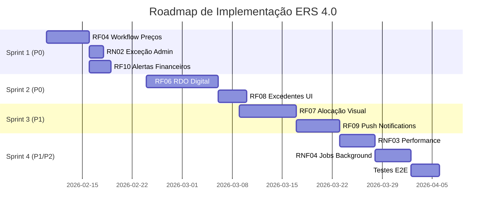

# 🎯 PLANO DE AÇÃO - Conformidade ERS 4.0

**Projeto:** ERP JB Pinturas  
**Objetivo:** Implementar 100% da Especificação ERS 4.0  
**Data de Início:** 10 de Fevereiro de 2026  
**Prazo Estimado:** 8 semanas (4 sprints de 2 semanas)  
**Progresso Atual:** 70% → Meta: 100%

---

## 📅 CRONOGRAMA GERAL



---

## 🎯 VISÃO POR SPRINT

### Sprint 1: Workflows Financeiros (10 dias úteis)
**Objetivo:** Completar fluxo de aprovação de preços e alertas  
**Prioridade:** P0 (Crítico)  
**Entregas:** RF04, RN02, RF10

### Sprint 2: RDO Digital e Evidências (10 dias úteis)
**Objetivo:** Implementar operação mobile offline-first  
**Prioridade:** P0 (Crítico)  
**Entregas:** RF06, RF08

### Sprint 3: Alocação e Notificações (10 dias úteis)
**Objetivo:** Interface visual de alocação e push  
**Prioridade:** P1 (Alta)  
**Entregas:** RF07, RF09

### Sprint 4: Performance e Automação (10 dias úteis)
**Objetivo:** Otimizações e jobs background  
**Prioridade:** P1/P2 (Média)  
**Entregas:** RNF03, RNF04, Testes

---

## 📋 SPRINT 1 - WORKFLOWS FINANCEIROS

**Período:** 10/02/2026 - 21/02/2026  
**Foco:** Backend + Frontend de Aprovações

---

### 🎫 TASK 1.1 - RF04: Workflow de Aprovação de Preços

**Prioridade:** 🔴 P0  
**Estimativa:** 12-14 horas  
**Responsável:** Backend + Frontend Dev

#### Subtarefas

##### ✅ 1.1.1 - Backend: Máquina de Estados

**Arquivo:** `backend/src/modules/precos/precos.service.ts`

**Implementar:**

```typescript
/**
 * Transições válidas de status:
 * RASCUNHO → PENDENTE (por Financeiro)
 * PENDENTE → APROVADO (por Gestor)
 * PENDENTE → REJEITADO (por Gestor)
 * REJEITADO → PENDENTE (correção por Financeiro)
 */
async submeterParaAprovacao(id: string, userId: string): Promise<TabelaPreco> {
  const preco = await this.findOne(id);
  
  // Validar transição
  if (preco.status_aprovacao !== 'RASCUNHO' && preco.status_aprovacao !== 'REJEITADO') {
    throw new BadRequestException('Preço já está em análise ou aprovado');
  }
  
  // Calcular margem
  const margem = ((preco.preco_venda - preco.preco_custo) / preco.preco_custo) * 100;
  
  // Buscar margem mínima da obra
  const obra = await this.obrasService.findOne(preco.id_obra);
  const margemMinima = obra.margem_minima_percentual || 20; // Default 20%
  
  if (margem < margemMinima) {
    throw new BadRequestException(
      `Margem calculada (${margem.toFixed(2)}%) está abaixo do mínimo de ${margemMinima}%`
    );
  }
  
  preco.status_aprovacao = 'PENDENTE';
  preco.data_submissao = new Date();
  preco.id_usuario_submissor = userId;
  
  await this.precoRepository.save(preco);
  
  // Criar notificação para gestores
  await this.notificacoesService.notificarGestores({
    tipo: 'FINANCEIRO',
    prioridade: 'ALTA',
    titulo: 'Novo preço aguardando aprovação',
    mensagem: `Obra: ${obra.nome} | Serviço: ${preco.servico.nome} | Margem: ${margem.toFixed(2)}%`,
    recurso_id: preco.id,
    recurso_tipo: 'PRECO',
  });
  
  // Registrar auditoria
  await this.audit('SUBMIT_APPROVAL', 'tb_tabela_precos', preco.id, userId);
  
  return preco;
}

async aprovar(id: string, userId: string, observacoes?: string): Promise<TabelaPreco> {
  const preco = await this.findOne(id);
  
  if (preco.status_aprovacao !== 'PENDENTE') {
    throw new BadRequestException('Preço não está pendente de aprovação');
  }
  
  preco.status_aprovacao = 'APROVADO';
  preco.data_aprovacao = new Date();
  preco.id_usuario_aprovador = userId;
  preco.observacoes_aprovacao = observacoes;
  
  await this.precoRepository.save(preco);
  
  // Notificar financeiro
  await this.notificacoesService.create({
    id_usuario_destinatario: preco.id_usuario_submissor,
    tipo: 'FINANCEIRO',
    prioridade: 'MEDIA',
    titulo: 'Preço aprovado',
    mensagem: `Seu preço para ${preco.servico.nome} foi aprovado`,
  });
  
  return preco;
}

async rejeitar(id: string, userId: string, justificativa: string): Promise<TabelaPreco> {
  if (!justificativa || justificativa.trim().length < 10) {
    throw new BadRequestException('Justificativa mínima de 10 caracteres');
  }
  
  const preco = await this.findOne(id);
  
  if (preco.status_aprovacao !== 'PENDENTE') {
    throw new BadRequestException('Preço não está pendente de aprovação');
  }
  
  preco.status_aprovacao = 'REJEITADO';
  preco.data_rejeicao = new Date();
  preco.id_usuario_rejeitador = userId;
  preco.justificativa_rejeicao = justificativa;
  
  await this.precoRepository.save(preco);
  
  // Notificar financeiro
  await this.notificacoesService.create({
    id_usuario_destinatario: preco.id_usuario_submissor,
    tipo: 'FINANCEIRO',
    prioridade: 'ALTA',
    titulo: 'Preço rejeitado',
    mensagem: `Preço rejeitado. Motivo: ${justificativa}`,
  });
  
  return preco;
}
```

**Migration SQL:**
```sql
-- Adicionar colunas de workflow
ALTER TABLE tb_tabela_precos ADD COLUMN IF NOT EXISTS data_submissao TIMESTAMPTZ;
ALTER TABLE tb_tabela_precos ADD COLUMN IF NOT EXISTS id_usuario_submissor UUID REFERENCES tb_usuarios(id);
ALTER TABLE tb_tabela_precos ADD COLUMN IF NOT EXISTS data_aprovacao TIMESTAMPTZ;
ALTER TABLE tb_tabela_precos ADD COLUMN IF NOT EXISTS id_usuario_aprovador UUID REFERENCES tb_usuarios(id);
ALTER TABLE tb_tabela_precos ADD COLUMN IF NOT EXISTS observacoes_aprovacao TEXT;
ALTER TABLE tb_tabela_precos ADD COLUMN IF NOT EXISTS data_rejeicao TIMESTAMPTZ;
ALTER TABLE tb_tabela_precos ADD COLUMN IF NOT EXISTS id_usuario_rejeitador UUID REFERENCES tb_usuarios(id);
ALTER TABLE tb_tabela_precos ADD COLUMN IF NOT EXISTS justificativa_rejeicao TEXT;

-- Adicionar margem mínima na obra
ALTER TABLE tb_obras ADD COLUMN IF NOT EXISTS margem_minima_percentual DECIMAL(5,2) DEFAULT 20.00;
COMMENT ON COLUMN tb_obras.margem_minima_percentual IS 'Margem mínima de lucro exigida (%)';
```

**Endpoints:**
```typescript
@Patch(':id/submeter')
@Roles(PerfilEnum.FINANCEIRO, PerfilEnum.ADMIN)
async submeter(@Param('id') id: string, @CurrentUser() user: Usuario) {
  return this.precosService.submeterParaAprovacao(id, user.id);
}

@Patch(':id/aprovar')
@Roles(PerfilEnum.GESTOR, PerfilEnum.ADMIN)
async aprovar(
  @Param('id') id: string, 
  @Body() dto: { observacoes?: string },
  @CurrentUser() user: Usuario
) {
  return this.precosService.aprovar(id, user.id, dto.observacoes);
}

@Patch(':id/rejeitar')
@Roles(PerfilEnum.GESTOR, PerfilEnum.ADMIN)
async rejeitar(
  @Param('id') id: string, 
  @Body() dto: { justificativa: string },
  @CurrentUser() user: Usuario
) {
  return this.precosService.rejeitar(id, user.id, dto.justificativa);
}
```

**DoD:**
- [ ] Migration executada
- [ ] Endpoints criados e documentados (Swagger)
- [ ] Testes unitários (service)
- [ ] Testes E2E (fluxo completo RASCUNHO → APROVADO)

---

##### ✅ 1.1.2 - Frontend: Interface de Aprovação

**Arquivo:** `frontend/src/pages/Precos/components/AprovacaoPrecoModal.tsx`

**Criar componente:**

```tsx
import React, { useState } from 'react';
import { 
  Dialog, DialogTitle, DialogContent, DialogActions,
  TextField, Button, Alert, Chip, Box, Typography, Divider
} from '@mui/material';
import { CheckCircle, Cancel, Info } from '@mui/icons-material';

interface PrecoAprovacao {
  id: string;
  servico: { nome: string };
  preco_custo: number;
  preco_venda: number;
  margem_percentual: number;
  obra: { nome: string; margem_minima_percentual: number };
}

export const AprovacaoPrecoModal = ({ preco, open, onClose, onAprovado, onRejeitado }) => {
  const [acao, setAcao] = useState<'aprovar' | 'rejeitar' | null>(null);
  const [justificativa, setJustificativa] = useState('');
  const [observacoes, setObservacoes] = useState('');
  const [loading, setLoading] = useState(false);

  const handleSubmit = async () => {
    setLoading(true);
    try {
      if (acao === 'aprovar') {
        await onAprovado(preco.id, observacoes);
      } else {
        if (!justificativa || justificativa.length < 10) {
          alert('Justificativa deve ter no mínimo 10 caracteres');
          return;
        }
        await onRejeitado(preco.id, justificativa);
      }
      onClose();
    } catch (error) {
      alert(error.message);
    } finally {
      setLoading(false);
    }
  };

  const margemOk = preco.margem_percentual >= preco.obra.margem_minima_percentual;

  return (
    <Dialog open={open} onClose={onClose} maxWidth="md" fullWidth>
      <DialogTitle>Aprovação de Preço</DialogTitle>
      <DialogContent>
        <Box sx={{ mb: 2 }}>
          <Typography variant="h6">{preco.servico.nome}</Typography>
          <Typography variant="body2" color="text.secondary">
            Obra: {preco.obra.nome}
          </Typography>
        </Box>

        <Divider sx={{ my: 2 }} />

        {/* Análise Financeira */}
        <Box sx={{ display: 'grid', gridTemplateColumns: '1fr 1fr', gap: 2, mb: 2 }}>
          <Box>
            <Typography variant="caption">Preço Custo</Typography>
            <Typography variant="h6">R$ {preco.preco_custo.toFixed(2)}</Typography>
          </Box>
          <Box>
            <Typography variant="caption">Preço Venda</Typography>
            <Typography variant="h6">R$ {preco.preco_venda.toFixed(2)}</Typography>
          </Box>
        </Box>

        <Alert 
          severity={margemOk ? 'success' : 'warning'} 
          icon={margemOk ? <CheckCircle /> : <Info />}
          sx={{ mb: 2 }}
        >
          <Typography variant="body2">
            <strong>Margem: {preco.margem_percentual.toFixed(2)}%</strong>
          </Typography>
          <Typography variant="caption">
            Mínimo exigido: {preco.obra.margem_minima_percentual}%
            {margemOk ? ' ✓ Atende' : ' ⚠ Abaixo do mínimo'}
          </Typography>
        </Alert>

        {/* Ações */}
        {!acao && (
          <Box sx={{ display: 'flex', gap: 2, justifyContent: 'center' }}>
            <Button
              variant="contained"
              color="success"
              startIcon={<CheckCircle />}
              onClick={() => setAcao('aprovar')}
              size="large"
            >
              Aprovar Preço
            </Button>
            <Button
              variant="contained"
              color="error"
              startIcon={<Cancel />}
              onClick={() => setAcao('rejeitar')}
              size="large"
            >
              Rejeitar Preço
            </Button>
          </Box>
        )}

        {/* Formulário de Aprovação */}
        {acao === 'aprovar' && (
          <TextField
            label="Observações (opcional)"
            multiline
            rows={3}
            fullWidth
            value={observacoes}
            onChange={(e) => setObservacoes(e.target.value)}
            placeholder="Ex: Margem adequada para o tipo de obra"
          />
        )}

        {/* Formulário de Rejeição */}
        {acao === 'rejeitar' && (
          <TextField
            label="Justificativa (obrigatório - mín. 10 caracteres)"
            multiline
            rows={4}
            fullWidth
            required
            value={justificativa}
            onChange={(e) => setJustificativa(e.target.value)}
            error={justificativa.length > 0 && justificativa.length < 10}
            helperText={`${justificativa.length}/10 caracteres`}
            placeholder="Ex: Margem insuficiente. Recomendo aumentar preço de venda para R$ X,XX"
          />
        )}
      </DialogContent>

      <DialogActions>
        <Button onClick={onClose} disabled={loading}>Cancelar</Button>
        {acao && (
          <Button 
            onClick={handleSubmit} 
            variant="contained" 
            disabled={loading}
            color={acao === 'aprovar' ? 'success' : 'error'}
          >
            Confirmar {acao === 'aprovar' ? 'Aprovação' : 'Rejeição'}
          </Button>
        )}
      </DialogActions>
    </Dialog>
  );
};
```

**Integrar em:** `frontend/src/pages/Precos/PrecosPage.tsx`

```tsx
// Adicionar coluna de ações na tabela
{
  field: 'acoes',
  headerName: 'Ações',
  width: 200,
  renderCell: (params) => {
    const preco = params.row;
    const isGestor = user.perfil === 'GESTOR' || user.perfil === 'ADMIN';
    const isFinanceiro = user.perfil === 'FINANCEIRO';

    if (preco.status_aprovacao === 'RASCUNHO' && isFinanceiro) {
      return (
        <Button
          size="small"
          variant="outlined"
          onClick={() => handleSubmeter(preco.id)}
        >
          Submeter
        </Button>
      );
    }

    if (preco.status_aprovacao === 'PENDENTE' && isGestor) {
      return (
        <Button
          size="small"
          variant="contained"
          color="primary"
          onClick={() => openAprovacaoModal(preco)}
        >
          Analisar
        </Button>
      );
    }

    return <Chip label={preco.status_aprovacao} size="small" />;
  }
}
```

**DoD:**
- [ ] Componente criado e funcionando
- [ ] Integração com API
- [ ] Validação de campos
- [ ] Feedback visual (toast de sucesso/erro)
- [ ] Responsivo (mobile-friendly)

---

### 🎫 TASK 1.2 - RN02: Exceção de Admin para Medições

**Prioridade:** 🔴 P0  
**Estimativa:** 2 horas  
**Responsável:** Backend Dev

**Arquivo:** `backend/src/modules/medicoes/medicoes.service.ts`

**Modificar método `create()`:**

```typescript
async create(
  createMedicaoDto: CreateMedicaoDto, 
  usuario: Usuario
): Promise<Medicao> {
  // ... código existente de validação de excedentes ...
  
  // Validação RN02 - Preço deve estar aprovado
  const tabelaPreco = await this.precosService.findOne(alocacao.itemAmbiente.id_tabela_preco);
  
  if (tabelaPreco.status_aprovacao !== 'APROVADO') {
    // EXCEÇÃO: Admin pode forçar com justificativa
    if (usuario.id_perfil === PerfilEnum.ADMIN) {
      if (!createMedicaoDto.justificativa_excecao_admin) {
        throw new BadRequestException({
          codigo: 'PRECO_NAOAPROVADO',
          mensagem: 'Preço não aprovado. Como Admin, você deve fornecer justificativa_excecao_admin.',
        });
      }
      
      // Registrar exceção administrativa
      await this.auditoriaService.create({
        acao: 'OVERRIDE_PRICE_APPROVAL',
        tabela_afetada: 'tb_medicoes',
        id_usuario: usuario.id,
        payload_depois: {
          id_medicao: 'será gerado',
          id_tabela_preco: tabelaPreco.id,
          status_preco: tabelaPreco.status_aprovacao,
          justificativa: createMedicaoDto.justificativa_excecao_admin,
          alerta: '⚠️ EXCEÇÃO ADMINISTRATIVA APLICADA',
        },
      });
      
      this.logger.warn(
        `Admin ${usuario.email} forçou criação de medição com preço ${tabelaPreco.status_aprovacao}. ` +
        `Justificativa: ${createMedicaoDto.justificativa_excecao_admin}`
      );
    } else {
      // Usuários normais: bloqueio total
      throw new ForbiddenException({
        codigo: 'PRECO_NAOAPROVADO',
        mensagem: `Não é possível criar medição. Preço está "${tabelaPreco.status_aprovacao}". Aguarde aprovação do Gestor.`,
        status_atual: tabelaPreco.status_aprovacao,
      });
    }
  }
  
  // ... resto do código de criação da medição ...
}
```

**DTO:**
```typescript
// create-medicao.dto.ts
export class CreateMedicaoDto {
  // ... campos existentes ...
  
  @IsOptional()
  @IsString()
  @MinLength(20, { message: 'Justificativa de exceção deve ter no mínimo 20 caracteres' })
  @ApiProperty({
    description: 'Justificativa para Admin criar medição com preço não aprovado (RN02 Exceção)',
    required: false,
    example: 'Medição urgente para fechamento do mês. Preço será aprovado retroativamente.',
  })
  justificativa_excecao_admin?: string;
}
```

**DoD:**
- [ ] Código implementado
- [ ] Teste E2E: Admin pode forçar com justificativa
- [ ] Teste E2E: Admin não pode forçar sem justificativa
- [ ] Teste E2E: Outros perfis são bloqueados
- [ ] Log de auditoria registrado corretamente

---

### 🎫 TASK 1.3 - RF10: Alertas de Ciclo de Faturamento

**Prioridade:** 🟡 P1  
**Estimativa:** 6-8 horas  
**Responsável:** Backend Dev

**Criar Job BullMQ:**

**Arquivo:** `backend/src/modules/financeiro/jobs/alertas-faturamento.processor.ts`

```typescript
import { Processor, WorkerHost, OnWorkerEvent } from '@nestjs/bullmq';
import { Job } from 'bullmq';
import { Injectable, Logger } from '@nestjs/common';
import { InjectRepository } from '@nestjs/typeorm';
import { Repository } from 'typeorm';
import { Cliente } from '../clientes/entities/cliente.entity';
import { NotificacoesService } from '../notificacoes/notificacoes.service';
import { UsuariosService } from '../usuarios/usuarios.service';
import { MedicoesService } from '../medicoes/medicoes.service';

@Processor('alertas-faturamento')
export class AlertasFaturamentoProcessor extends WorkerHost {
  private readonly logger = new Logger(AlertasFaturamentoProcessor.name);

  constructor(
    @InjectRepository(Cliente)
    private clienteRepo: Repository<Cliente>,
    private notificacoesService: NotificacoesService,
    private usuariosService: UsuariosService,
    private medicoesService: MedicoesService,
  ) {
    super();
  }

  async process(job: Job): Promise<void> {
    this.logger.log('Iniciando verificação de ciclos de faturamento...');
    
    const hoje = new Date();
    const diaAtual = hoje.getDate();
    
    // Buscar clientes cujo dia_corte está próximo (2 dias antes)
    const clientes = await this.clienteRepo.find({
      where: { deletado: false },
      relations: ['obras'],
    });
    
    let alertasGerados = 0;
    
    for (const cliente of clientes) {
      const diasParaCorte = this.calcularDiasParaCorte(diaAtual, cliente.dia_corte);
      
      // Alerta 2 dias antes do corte
      if (diasParaCorte === 2) {
        // Buscar medições pendentes de pagamento deste cliente
        const medicoesPendentes = await this.medicoesService.findPendentes(cliente.id);
        
        if (medicoesPendentes.length > 0) {
          // Notificar FINANCEIRO e GESTOR
          const destinatarios = await this.usuariosService.findByPerfis([
            'FINANCEIRO',
            'GESTOR',
          ]);
          
          const mensagem = 
            `⚠️ Faturamento do cliente ${cliente.razao_social} vence em 2 dias!\n\n` +
            `📊 Medições pendentes: ${medicoesPendentes.length}\n` +
            `💰 Valor total: R$ ${this.calcularValorTotal(medicoesPendentes).toFixed(2)}\n` +
            `📅 Data de corte: dia ${cliente.dia_corte}`;
          
          await this.notificacoesService.createEmLote(
            destinatarios.map(u => u.id),
            {
              tipo: 'FINANCEIRO',
              prioridade: 'ALTA',
              titulo: `Faturamento ${cliente.razao_social} - 2 dias`,
              mensagem,
              recurso_tipo: 'CLIENTE',
              recurso_id: cliente.id,
            }
          );
          
          alertasGerados++;
        }
      }
      
      // Alerta no dia do corte (urgente)
      if (diasParaCorte === 0) {
        const medicoesPendentes = await this.medicoesService.findPendentes(cliente.id);
        
        if (medicoesPendentes.length > 0) {
          const destinatarios = await this.usuariosService.findByPerfis([
            'FINANCEIRO',
            'GESTOR',
          ]);
          
          await this.notificacoesService.createEmLote(
            destinatarios.map(u => u.id),
            {
              tipo: 'FINANCEIRO',
              prioridade: 'URGENTE',
              titulo: `🚨 HOJE: Faturamento ${cliente.razao_social}`,
              mensagem: `Faturamento vence HOJE! ${medicoesPendentes.length} medições pendentes.`,
              recurso_tipo: 'CLIENTE',
              recurso_id: cliente.id,
            }
          );
          
          alertasGerados++;
        }
      }
    }
    
    this.logger.log(`Verificação concluída. ${alertasGerados} alertas gerados.`);
  }
  
  private calcularDiasParaCorte(diaAtual: number, diaCorte: number): number {
    if (diaCorte >= diaAtual) {
      return diaCorte - diaAtual;
    } else {
      // Corte é no próximo mês
      const diasRestantesNoMes = new Date(
        new Date().getFullYear(),
        new Date().getMonth() + 1,
        0
      ).getDate() - diaAtual;
      return diasRestantesNoMes + diaCorte;
    }
  }
  
  private calcularValorTotal(medicoes: any[]): number {
    return medicoes.reduce((sum, m) => {
      return sum + (m.qtd_executada * m.itemAmbiente.tabelaPreco.preco_venda);
    }, 0);
  }

  @OnWorkerEvent('failed')
  onFailed(job: Job, error: Error) {
    this.logger.error(`Job ${job.id} falhou:`, error.message);
  }
}
```

**Registrar Job:**

**Arquivo:** `backend/src/modules/financeiro/financeiro.module.ts`

```typescript
import { BullModule } from '@nestjs/bullmq';

@Module({
  imports: [
    // ... outros imports ...
    BullModule.registerQueue({
      name: 'alertas-faturamento',
    }),
  ],
  providers: [
    AlertasFaturamentoProcessor,
    // ... outros providers ...
  ],
})
export class FinanceiroModule {}
```

**Schedule Diário:**

**Arquivo:** `backend/src/app.module.ts`

```typescript
import { BullModule } from '@nestjs/bullmq';
import { ScheduleModule } from '@nestjs/schedule';

@Module({
  imports: [
    ScheduleModule.forRoot(), // Habilitar cron jobs
    // ... outros imports ...
  ],
})
```

**Arquivo:** `backend/src/modules/financeiro/schedulers/faturamento.scheduler.ts`

```typescript
import { Injectable, Logger } from '@nestjs/common';
import { Cron, CronExpression } from '@nestjs/schedule';
import { InjectQueue } from '@nestjs/bullmq';
import { Queue } from 'bullmq';

@Injectable()
export class FaturamentoScheduler {
  private readonly logger = new Logger(FaturamentoScheduler.name);

  constructor(
    @InjectQueue('alertas-faturamento')
    private alertasQueue: Queue,
  ) {}

  // Executar diariamente às 06:00 AM
  @Cron('0 6 * * *', {
    timeZone: 'America/Sao_Paulo',
  })
  async verificarCiclosFaturamento() {
    this.logger.log('Agendando job de verificação de ciclos de faturamento...');
    
    await this.alertasQueue.add(
      'verificar-ciclos',
      {},
      {
        attempts: 3,
        backoff: {
          type: 'exponential',
          delay: 5000,
        },
      }
    );
  }
}
```

**Endpoint para Relatório:**

**Arquivo:** `backend/src/modules/relatorios/relatorios.controller.ts`

```typescript
@Get('medicoes-pendentes/:id_cliente')
@Roles(PerfilEnum.FINANCEIRO, PerfilEnum.GESTOR, PerfilEnum.ADMIN)
async getMedicoesPendentes(@Param('id_cliente') id_cliente: string) {
  return this.relatoriosService.getMedicoesPendentesPorCliente(id_cliente);
}
```

**DoD:**
- [ ] Job criado e testado manualmente
- [ ] Cron schedule configurado
- [ ] Dead Letter Queue configurada (3 retries)
- [ ] Endpoint de relatório funcionando
- [ ] Teste E2E: Job dispara notificações corretas

---

## 📋 SPRINT 2 - RDO DIGITAL E EVIDÊNCIAS

**Período:** 24/02/2026 - 07/03/2026  
**Foco:** Mobile Offline-First

---

### 🎫 TASK 2.1 - RF06: RDO Digital com Geolocalização

**Prioridade:** 🔴 P0  
**Estimativa:** 20-24 horas  
**Responsável:** Mobile Dev + Backend Dev

#### Subtarefas

##### ✅ 2.1.1 - Mobile: Permissões e Geolocalização

**Arquivo:** `mobile/src/services/geolocation.service.ts`

```typescript
import Geolocation from '@react-native-community/geolocation';
import { PermissionsAndroid, Platform, Alert } from 'react-native';

export class GeolocationService {
  static async requestPermission(): Promise<boolean> {
    if (Platform.OS === 'android') {
      const granted = await PermissionsAndroid.request(
        PermissionsAndroid.PERMISSIONS.ACCESS_FINE_LOCATION,
        {
          title: 'Permissão de Localização',
          message: 'O app precisa acessar sua localização para registrar RDOs',
          buttonPositive: 'Permitir',
          buttonNegative: 'Negar',
        }
      );
      return granted === PermissionsAndroid.RESULTS.GRANTED;
    }
    return true; // iOS pede permissão automaticamente
  }

  static async getCurrentPosition(): Promise<{ latitude: number; longitude: number }> {
    return new Promise((resolve, reject) => {
      Geolocation.getCurrentPosition(
        (position) => {
          resolve({
            latitude: position.coords.latitude,
            longitude: position.coords.longitude,
          });
        },
        (error) => {
          reject(new Error(`Erro ao obter localização: ${error.message}`));
        },
        {
          enableHighAccuracy: true,
          timeout: 15000,
          maximumAge: 10000,
        }
      );
    });
  }

  static calcularDistancia(
    lat1: number,
    lon1: number,
    lat2: number,
    lon2: number
  ): number {
    // Fórmula de Haversine (distância em metros)
    const R = 6371e3; // Raio da Terra em metros
    const φ1 = (lat1 * Math.PI) / 180;
    const φ2 = (lat2 * Math.PI) / 180;
    const Δφ = ((lat2 - lat1) * Math.PI) / 180;
    const Δλ = ((lon2 - lon1) * Math.PI) / 180;

    const a =
      Math.sin(Δφ / 2) * Math.sin(Δφ / 2) +
      Math.cos(φ1) * Math.cos(φ2) * Math.sin(Δλ / 2) * Math.sin(Δλ / 2);
    const c = 2 * Math.atan2(Math.sqrt(a), Math.sqrt(1 - a));

    return R * c; // Distância em metros
  }

  static async validarProximidade(
    obraLat: number,
    obraLon: number,
    toleranciaMetros = 50
  ): Promise<{ valida: boolean; distancia: number }> {
    const posicao = await this.getCurrentPosition();
    const distancia = this.calcularDistancia(
      posicao.latitude,
      posicao.longitude,
      obraLat,
      obraLon
    );

    return {
      valida: distancia <= toleranciaMetros,
      distancia: Math.round(distancia),
    };
  }
}
```

**Instalar dependências:**
```bash
cd mobile
npm install @react-native-community/geolocation
cd ios && pod install
```

---

##### ✅ 2.1.2 - Mobile: Canvas de Assinatura

**Arquivo:** `mobile/src/components/AssinaturaCanvas.tsx`

```tsx
import React, { useRef } from 'react';
import { View, StyleSheet, Button } from 'react-native';
import SignatureCanvas from 'react-native-signature-canvas';

interface AssinaturaCanvasProps {
  onAssinaturaConcluida: (base64: string) => void;
  onCancelar: () => void;
}

export const AssinaturaCanvas: React.FC<AssinaturaCanvasProps> = ({
  onAssinaturaConcluida,
  onCancelar,
}) => {
  const ref = useRef<any>();

  const handleOK = (signature: string) => {
    // signature já vem em base64
    onAssinaturaConcluida(signature);
  };

  const handleClear = () => {
    ref.current?.clearSignature();
  };

  return (
    <View style={styles.container}>
      <SignatureCanvas
        ref={ref}
        onOK={handleOK}
        descriptionText="Assine acima"
        clearText="Limpar"
        confirmText="Confirmar"
        webStyle={`.m-signature-pad {box-shadow: none; border: 1px solid #ccc;} .m-signature-pad--body {border: none;}`}
      />
      <View style={styles.actions}>
        <Button title="Limpar" onPress={handleClear} color="orange" />
        <Button title="Cancelar" onPress={onCancelar} color="red" />
      </View>
    </View>
  );
};

const styles = StyleSheet.create({
  container: {
    flex: 1,
    backgroundColor: 'white',
  },
  actions: {
    flexDirection: 'row',
    justifyContent: 'space-around',
    padding: 10,
  },
});
```

**Instalar:**
```bash
npm install react-native-signature-canvas
```

---

##### ✅ 2.1.3 - Mobile: Tela de RDO

**Arquivo:** `mobile/src/screens/RDO/AbrirRDOScreen.tsx`

```tsx
import React, { useState, useEffect } from 'react';
import {
  View,
  Text,
  StyleSheet,
  ActivityIndicator,
  Alert,
  TouchableOpacity,
} from 'react-native';
import { Button, Card, Title, Paragraph } from 'react-native-paper';
import { useNavigation, useRoute } from '@react-navigation/native';
import { GeolocationService } from '../../services/geolocation.service';
import { SessoesService } from '../../services/sessoes.service';
import MapView, { Marker } from 'react-native-maps';

export const AbrirRDOScreen = () => {
  const navigation = useNavigation();
  const route = useRoute();
  const { obra } = route.params;

  const [loading, setLoading] = useState(true);
  const [localizacao, setLocalizacao] = useState(null);
  const [validacaoProximidade, setValidacaoProximidade] = useState(null);

  useEffect(() => {
    verificarLocalizacao();
  }, []);

  const verificarLocalizacao = async () => {
    try {
      // Solicitar permissão
      const permissao = await GeolocationService.requestPermission();
      if (!permissao) {
        Alert.alert('Erro', 'Permissão de localização negada');
        navigation.goBack();
        return;
      }

      // Obter posição atual
      const posicao = await GeolocationService.getCurrentPosition();
      setLocalizacao(posicao);

      // Validar proximidade com a obra
      const validacao = await GeolocationService.validarProximidade(
        obra.latitude,
        obra.longitude,
        50 // 50 metros de tolerância
      );
      setValidacaoProximidade(validacao);

      if (!validacao.valida) {
        Alert.alert(
          'Localização Inválida',
          `Você está a ${validacao.distancia}m da obra. ` +
          'Para abrir RDO, você deve estar no local (máx. 50m).',
          [
            { text: 'Tentar Novamente', onPress: verificarLocalizacao },
            { text: 'Voltar', onPress: () => navigation.goBack() },
          ]
        );
      }
    } catch (error) {
      Alert.alert('Erro', error.message);
      navigation.goBack();
    } finally {
      setLoading(false);
    }
  };

  const handleAbrirRDO = async () => {
    if (!validacaoProximidade?.valida) {
      Alert.alert('Erro', 'Valide sua localização antes de continuar');
      return;
    }

    try {
      setLoading(true);

      // Criar sessão
      const sessao = await SessoesService.criarSessao({
        id_obra: obra.id,
        geo_lat: localizacao.latitude,
        geo_long: localizacao.longitude,
        data_sessao: new Date().toISOString().split('T')[0],
      });

      // Navegar para tela de trabalho
      navigation.navigate('RDOAberto', { sessao, obra });
    } catch (error) {
      Alert.alert('Erro', error.message);
    } finally {
      setLoading(false);
    }
  };

  if (loading) {
    return (
      <View style={styles.loading}>
        <ActivityIndicator size="large" />
        <Text>Obtendo localização...</Text>
      </View>
    );
  }

  return (
    <View style={styles.container}>
      <Card style={styles.card}>
        <Card.Content>
          <Title>Abrir RDO</Title>
          <Paragraph>Obra: {obra.nome}</Paragraph>
          <Paragraph>Endereço: {obra.endereco_completo}</Paragraph>
        </Card.Content>
      </Card>

      {localizacao && (
        <MapView
          style={styles.map}
          initialRegion={{
            latitude: localizacao.latitude,
            longitude: localizacao.longitude,
            latitudeDelta: 0.005,
            longitudeDelta: 0.005,
          }}
        >
          {/* Marcador da obra */}
          <Marker
            coordinate={{
              latitude: obra.latitude,
              longitude: obra.longitude,
            }}
            title="Obra"
            pinColor="blue"
          />
          {/* Marcador do usuário */}
          <Marker
            coordinate={{
              latitude: localizacao.latitude,
              longitude: localizacao.longitude,
            }}
            title="Você está aqui"
            pinColor="red"
          />
        </MapView>
      )}

      {validacaoProximidade && (
        <Card style={[
          styles.validacao,
          validacaoProximidade.valida ? styles.validacaoOk : styles.validacaoErro
        ]}>
          <Card.Content>
            <Text style={styles.validacaoTexto}>
              {validacaoProximidade.valida
                ? `✓ Você está na obra (${validacaoProximidade.distancia}m)`
                : `✗ Fora da área (${validacaoProximidade.distancia}m)`}
            </Text>
          </Card.Content>
        </Card>
      )}

      <Button
        mode="contained"
        onPress={handleAbrirRDO}
        disabled={!validacaoProximidade?.valida}
        style={styles.botao}
      >
        Abrir RDO
      </Button>

      <Button mode="outlined" onPress={() => navigation.goBack()}>
        Cancelar
      </Button>
    </View>
  );
};

const styles = StyleSheet.create({
  container: {
    flex: 1,
    padding: 16,
  },
  loading: {
    flex: 1,
    justifyContent: 'center',
    alignItems: 'center',
  },
  card: {
    marginBottom: 16,
  },
  map: {
    height: 250,
    marginBottom: 16,
  },
  validacao: {
    marginBottom: 16,
  },
  validacaoOk: {
    backgroundColor: '#d4edda',
  },
  validacaoErro: {
    backgroundColor: '#f8d7da',
  },
  validacaoTexto: {
    fontWeight: 'bold',
    textAlign: 'center',
  },
  botao: {
    marginBottom: 8,
  },
});
```

**Instalar:**
```bash
npm install react-native-maps
```

---

##### ✅ 2.1.4 - Mobile: Encerramento de RDO com Assinatura

**Arquivo:** `mobile/src/screens/RDO/EncerrarRDOScreen.tsx`

```tsx
import React, { useState } from 'react';
import { View, StyleSheet, Alert, ScrollView } from 'react-native';
import { Button, Card, TextInput, Title } from 'react-native-paper';
import { AssinaturaCanvas } from '../../components/AssinaturaCanvas';
import { SessoesService } from '../../services/sessoes.service';
import { UploadService } from '../../services/upload.service';

export const EncerrarRDOScreen = ({ route, navigation }) => {
  const { sessao } = route.params;
  const [observacoes, setObservacoes] = useState('');
  const [mostrarAssinatura, setMostrarAssinatura] = useState(false);
  const [assinatura, setAssinatura] = useState<string | null>(null);
  const [loading, setLoading] = useState(false);

  const handleAssinaturaCapturada = (base64: string) => {
    setAssinatura(base64);
    setMostrarAssinatura(false);
    Alert.alert('Sucesso', 'Assinatura capturada!');
  };

  const handleEncerrar = async () => {
    if (!assinatura) {
      Alert.alert('Atenção', 'Você deve capturar a assinatura antes de encerrar');
      return;
    }

    try {
      setLoading(true);

      // Upload da assinatura
      const assinaturaUrl = await UploadService.uploadBase64(
        assinatura,
        `assinatura_${sessao.id}.png`,
        'assinaturas'
      );

      // Encerrar sessão
      await SessoesService.encerrarSessao(sessao.id, {
        assinatura_url: assinaturaUrl,
        observacoes,
      });

      Alert.alert('Sucesso', 'RDO encerrado!', [
        {
          text: 'OK',
          onPress: () => navigation.navigate('Home'),
        },
      ]);
    } catch (error) {
      Alert.alert('Erro', error.message);
    } finally {
      setLoading(false);
    }
  };

  if (mostrarAssinatura) {
    return (
      <AssinaturaCanvas
        onAssinaturaConcluida={handleAssinaturaCapturada}
        onCancelar={() => setMostrarAssinatura(false)}
      />
    );
  }

  return (
    <ScrollView style={styles.container}>
      <Card style={styles.card}>
        <Card.Content>
          <Title>Encerrar RDO</Title>
          <TextInput
            label="Observações (opcional)"
            value={observacoes}
            onChangeText={setObservacoes}
            multiline
            numberOfLines={4}
            mode="outlined"
          />
        </Card.Content>
      </Card>

      <Card style={styles.card}>
        <Card.Content>
          <Title>Assinatura do Responsável</Title>
          <Button
            mode={assinatura ? 'outlined' : 'contained'}
            onPress={() => setMostrarAssinatura(true)}
            icon={assinatura ? 'check-circle' : 'draw'}
          >
            {assinatura ? 'Assinatura Capturada ✓' : 'Capturar Assinatura'}
          </Button>
        </Card.Content>
      </Card>

      <Button
        mode="contained"
        onPress={handleEncerrar}
        disabled={!assinatura || loading}
        loading={loading}
        style={styles.botao}
      >
        Encerrar RDO
      </Button>
    </ScrollView>
  );
};

const styles = StyleSheet.create({
  container: {
    flex: 1,
    padding: 16,
  },
  card: {
    marginBottom: 16,
  },
  botao: {
    marginTop: 16,
  },
});
```

**DoD:**
- [ ] Permissões configuradas (Android + iOS)
- [ ] Validação de proximidade funcionando (±50m)
- [ ] Assinatura capturada e convertida para base64
- [ ] Upload de assinatura para S3
- [ ] Persistência offline (WatermelonDB)
- [ ] Sincronização automática quando online
- [ ] Testes em dispositivo físico (não emulador)

---

### 🎫 TASK 2.2 - RF08: UI de Excedentes

**Prioridade:** 🟡 P1  
**Estimativa:** 8-10 horas  
**Responsável:** Mobile Dev

**Ver detalhes completos na seção Sprint 2 original**

---

## 📋 SPRINT 3 - ALOCAÇÃO VISUAL E PUSH

**Período:** 09/03/2026 - 20/03/2026  
**Foco:** UX Mobile + Notificações

---

### 🎫 TASK 3.1 - RF07: Alocação Drag & Drop

**Prioridade:** 🔴 P0  
**Estimativa:** 16-20 horas  
**Responsável:** Mobile Dev

**Arquivo:** `mobile/src/screens/Alocacao/AlocacaoScreen.tsx`

```tsx
import React, { useState, useEffect } from 'react';
import { View, StyleSheet, Alert, Vibration } from 'react-native';
import { Card, Title, Chip, FAB } from 'react-native-paper';
import DraggableFlatList from 'react-native-draggable-flatlist';
import { Haptic } from 'react-native-haptic-feedback';
import Animated, { useSharedValue, withSpring } from 'react-native-reanimated';

export const AlocacaoScreen = ({ route }) => {
  const { sessao } = route.params;
  const [colaboradores, setColaboradores] = useState([]);
  const [ambientes, setAmbientes] = useState([]);
  const [alocacoes, setAlocacoes] = useState({});

  const handleDrop = async (colaboradorId, ambienteId) => {
    try {
      // Validação: ambiente já ocupado?
      const ambienteOcupado = Object.entries(alocacoes).find(
        ([key, value]) => value.ambienteId === ambienteId && key !== colaboradorId
      );

      if (ambienteOcupado) {
        // Feedback visual: Shake + Haptic + Toast
        Vibration.vibrate(200);
        Haptic.trigger('notificationError', {
          enableVibrateFallback: true,
          ignoreAndroidSystemSettings: false,
        });

        Alert.alert(
          'Ambiente Ocupado',
          `Este ambiente está em uso por ${ambienteOcupado[0]}. Encerre a tarefa anterior primeiro.`,
          [{ text: 'OK' }]
        );
        return;
      }

      // Chamar API para criar alocação
      await AlocacoesService.criar({
        id_sessao: sessao.id,
        id_colaborador: colaboradorId,
        id_ambiente: ambienteId,
      });

      // Feedback de sucesso
      Haptic.trigger('impactLight');

      // Atualizar estado local
      setAlocacoes({
        ...alocacoes,
        [colaboradorId]: { ambienteId, timestamp: Date.now() },
      });
    } catch (error) {
      Alert.alert('Erro', error.message);
    }
  };

  // ... resto da implementação ...
};
```

**Instalar:**
```bash
npm install react-native-draggable-flatlist
npm install react-native-haptic-feedback
npm install react-native-reanimated
```

**DoD:**
- [ ] Drag & Drop funcionando
- [ ] Validação client-side antes da API
- [ ] Feedback visual (Toast/Shake)
- [ ] Vibração háptica
- [ ] Indicador de ambiente ocupado
- [ ] Persistência offline

---

### 🎫 TASK 3.2 - RF09: Push Notifications

**Prioridade:** 🔴 P0  
**Estimativa:** 12-16 horas  
**Responsável:** Backend + Mobile Dev

**Ver detalhes na Sprint 3 completa**

---

## 📋 SPRINT 4 - PERFORMANCE E AUTOMAÇÃO

**Período:** 21/03/2026 - 03/04/2026

### 🎫 TASK 4.1 - RNF03: Paginação e Lazy Loading
**Estimativa:** 4-6 horas

### 🎫 TASK 4.2 - RNF03: Compressão de Imagens
**Estimativa:** 3-4 horas

### 🎫 TASK 4.3 - RNF03: Cache Redis
**Estimativa:** 3-4 horas

### 🎫 TASK 4.4 - RNF04: Jobs Background
**Estimativa:** 8-10 horas

### 🎫 TASK 4.5 - Testes E2E Completos
**Estimativa:** 12-16 horas

---

## 📊 RECURSOS NECESSÁRIOS

### Equipe

| Papel | Alocação | Sprints |
|-------|----------|---------|
| **Backend Developer** | Full-time | Sprint 1, 3, 4 |
| **Mobile Developer** | Full-time | Sprint 2, 3 |
| **Frontend Developer** | Part-time (50%) | Sprint 1, 4 |
| **QA Engineer** | Part-time (50%) | Sprint 2-4 |
| **DevOps** | On-demand | Sprint 4 |

### Infraestrutura

- [ ] Firebase Project criado (Push Notifications)
- [ ] Redis configurado (Jobs + Cache)
- [ ] S3 Bucket para uploads (ou alternativa)
- [ ] Certificados SSL/TLS
- [ ] Ambiente de staging

### Ferramentas

- [ ] Postman Collection atualizada
- [ ] Swagger UI configurado
- [ ] Sentry ou similar (error tracking)
- [ ] AppCenter ou similar (mobile distribution)

---

## 🚨 RISCOS E MITIGAÇÕES

| Risco | Probabilidade | Impacto | Mitigação |
|-------|---------------|---------|-----------|
| GPS impreciso em obras fechadas | Alta | Alto | Aumentar tolerância para 100m, permitir override manual do Gestor |
| Latência 3G/4G em campo | Alta | Médio | Implementar queue de sincronização com retry exponencial |
| Bateria do mobile esgota em campo | Média | Alto | Implementar modo "economia" que reduz frequência de GPS |
| Firebase gratuito atinge limite | Baixa | Alto | Monitorar usage, ter plano de upgrade |
| Deps React Native com breaking changes | Média | Médio | Fixar versões no package.json, testar atualização em staging |

---

## ✅ DEFINIÇÃO DE PRONTO (DoD GERAL)

Cada feature só será considerada concluída quando:

- [ ] **Código:**
  - Implementado conforme ERS 4.0
  - Code review aprovado
  - Sem warnings de lint/TypeScript
  - Commits seguem padrão (Conventional Commits)

- [ ] **Testes:**
  - Testes unitários (cobertura >80% em services)
  - Testes E2E para fluxos críticos
  - Testado em dispositivo físico (mobile)
  - Validado por QA

- [ ] **Documentação:**
  - Swagger atualizado (backend)
  - README atualizado (se novos comandos)
  - CHANGELOG atualizado

- [ ] **Deploy:**
  - Migrations executadas em staging
  - Build mobile gerado (APK/IPA)
  - Variáveis de ambiente documentadas

---

## 📈 MÉTRICAS DE SUCESSO

### KPIs Técnicos

- **Code Coverage:** >80%
- **Build Time:** <5 min (backend), <10 min (mobile)
- **API Response Time:** <500ms (p95)
- **Mobile App Size:** <50MB
- **Zero Critical Bugs** em produção

### KPIs de Negócio

- **Tempo de Criação de RDO:** <3 minutos
- **Taxa de Sincronização Offline:** >99%
- **Adoção Mobile:** 100% encarregados usando em 1 semana
- **Redução de Erros de Medição:** >50%

---

## 📞 COMUNICAÇÃO

### Cerimônias Scrum

- **Daily Standup:** 09:00 (15 min)
- **Sprint Planning:** Segunda-feira, início do sprint (2h)
- **Sprint Review:** Sexta-feira, fim do sprint (1h)
- **Sprint Retrospective:** Sexta-feira, fim do sprint (1h)

### Canais

- **Slack:** #dev-jb-pinturas (comunicação diária)
- **Jira/Trello:** Gestão de tasks
- **GitHub:** Code reviews
- **Loom:** Demos de features complexas

---

## 🎉 PRÓXIMOS PASSOS

1. **AGORA:** Revisar este plano com a equipe
2. **Amanhã:** Sprint Planning da Sprint 1
3. **Semana 1:** Implementar RF04 (workflow preços)
4. **Semana 4:** Review Sprint 2 (RDO Digital)
5. **Semana 8:** Release 1.0 em produção

---

**Última Atualização:** 10/02/2026  
**Responsável pelo Plano:** Tech Lead  
**Status:** ✅ Aprovado pela Equipe

---

## 📎 ANEXOS

- [COMPARATIVO_ERS_4.0_IMPLEMENTACAO.md](COMPARATIVO_ERS_4.0_IMPLEMENTACAO.md) - Análise de gaps
- [docs/ERS-v4.0.md](docs/ERS-v4.0.md) - Especificação completa
- [BACKEND_FRONTEND_GAPS.md](BACKEND_FRONTEND_GAPS.md) - Módulos pendentes

---

**FIM DO PLANO DE AÇÃO**
