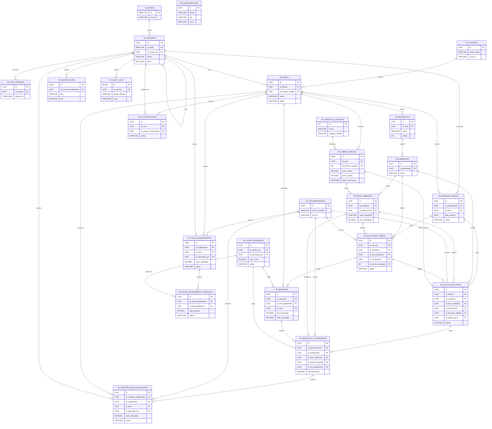

# DER do Banco de Dados - JB Pinturas

Diagrama entidade relacionamento baseado nas entidades TypeORM do backend.

```mermaid
erDiagram
    TB_PERFIS {
        SMALLINT id PK
        VARCHAR nome
    }

    TB_USUARIOS {
        UUID id PK
        SMALLINT id_perfil FK
        UUID id_criado_por FK
        VARCHAR email
        BOOLEAN ativo
    }

    TB_AUTH_SESSOES {
        UUID id PK
        UUID id_usuario FK
        TIMESTAMP expira_em
    }

    TB_CLIENTES {
        UUID id PK
        VARCHAR razao_social
        VARCHAR cnpj_nif
    }

    TB_OBRAS {
        UUID id PK
        UUID id_cliente FK
        UUID id_usuario_criador FK
        VARCHAR nome
        VARCHAR status
    }

    TB_PAVIMENTOS {
        UUID id PK
        UUID id_obra FK
        VARCHAR nome
        INT ordem
    }

    TB_AMBIENTES {
        UUID id PK
        UUID id_pavimento FK
        VARCHAR nome
    }

    TB_SERVICOS_CATALOGO {
        INT id PK
        VARCHAR nome
        VARCHAR unidade_medida
    }

    TB_TABELA_PRECOS {
        UUID id PK
        UUID id_obra FK
        INT id_servico_catalogo FK
        DECIMAL preco_custo
        DECIMAL preco_venda
        VARCHAR status_aprovacao
    }

    TB_ITENS_AMBIENTE {
        UUID id PK
        UUID id_ambiente FK
        UUID id_tabela_preco FK
        VARCHAR nome_elemento
        DECIMAL area_planejada
    }

    TB_COLABORADORES {
        UUID id PK
        VARCHAR nome_completo
        VARCHAR cpf_nif
    }

    TB_SESSOES_DIARIAS {
        UUID id PK
        UUID id_encarregado FK
        UUID id_obra FK
        DATE data_sessao
        VARCHAR status
    }

    TB_ALOCACOES_TAREFA {
        UUID id PK
        UUID id_sessao FK
        UUID id_ambiente FK
        UUID id_item_ambiente FK
        UUID id_colaborador FK
        INT id_servico_catalogo FK
        VARCHAR status
    }

    TB_ALOCACOES_ITENS {
        UUID id PK
        UUID id_sessao FK
        UUID id_ambiente FK
        UUID id_item_ambiente FK
        UUID id_colaborador FK
        UUID id_alocacao_legado FK
        UUID id_tabela_preco FK
        VARCHAR status
    }

    TB_MEDICOES {
        UUID id PK
        UUID id_alocacao FK
        UUID id_lote_pagamento FK
        UUID id_obra FK
        DECIMAL qtd_executada
        DECIMAL valor_calculado
    }

    TB_LOTES_PAGAMENTO {
        UUID id PK
        UUID id_criado_por FK
        UUID id_aprovado_por FK
        DECIMAL valor_total
        VARCHAR status
    }

    TB_MEDICOES_COLABORADOR {
        UUID id PK
        UUID id_alocacao_item FK
        UUID id_colaborador FK
        UUID id_item_ambiente FK
        UUID id_medicao_legado FK
        UUID id_lote_pagamento FK
        DECIMAL qtd_executada
    }

    TB_APROPRIACOES_FINANCEIRAS {
        UUID id PK
        UUID id_medicao_colaborador FK
        UUID id_colaborador FK
        UUID id_obra FK
        UUID id_aprovado_por FK
        DECIMAL valor_calculado
        VARCHAR status
    }

    TB_VALES_ADIANTAMENTO {
        UUID id PK
        UUID id_colaborador FK
        UUID id_obra FK
        UUID id_aprovado_por FK
        DECIMAL valor_solicitado
        VARCHAR status
    }

    TB_VALES_ADIANTAMENTO_PARCELAS {
        UUID id PK
        UUID id_vale_adiantamento FK
        UUID id_lote_pagamento FK
        DECIMAL valor_parcela
        VARCHAR status
    }

    TB_NOTIFICACOES {
        UUID id PK
        UUID id_usuario_destinatario FK
        VARCHAR tipo
        BOOLEAN lida
    }

    TB_OS_FINALIZACAO {
        UUID id PK
        UUID id_obra FK
        UUID id_usuario_responsavel FK
        VARCHAR status
    }

    TB_AUDIT_LOGS {
        BIGINT id PK
        UUID id_usuario FK
        VARCHAR tabela_afetada
        VARCHAR acao
    }

    TB_CONFIGURACOES {
        UUID id PK
        VARCHAR chave
        VARCHAR tipo
        BOOLEAN ativo
    }

    TB_PERFIS ||--o{ TB_USUARIOS : possui
    TB_USUARIOS ||--o{ TB_USUARIOS : criou
    TB_USUARIOS ||--o{ TB_AUTH_SESSOES : autentica

    TB_CLIENTES ||--o{ TB_OBRAS : contrata
    TB_USUARIOS ||--o{ TB_OBRAS : cria
    TB_OBRAS ||--o{ TB_PAVIMENTOS : contem
    TB_PAVIMENTOS ||--o{ TB_AMBIENTES : contem
    TB_AMBIENTES ||--o{ TB_ITENS_AMBIENTE : contem

    TB_OBRAS ||--o{ TB_TABELA_PRECOS : precifica
    TB_SERVICOS_CATALOGO ||--o{ TB_TABELA_PRECOS : referencia
    TB_TABELA_PRECOS ||--o{ TB_ITENS_AMBIENTE : aplica

    TB_USUARIOS ||--o{ TB_SESSOES_DIARIAS : encarrega
    TB_OBRAS ||--o{ TB_SESSOES_DIARIAS : executa

    TB_SESSOES_DIARIAS ||--o{ TB_ALOCACOES_TAREFA : gera
    TB_AMBIENTES ||--o{ TB_ALOCACOES_TAREFA : recebe
    TB_ITENS_AMBIENTE ||--o{ TB_ALOCACOES_TAREFA : detalha
    TB_COLABORADORES ||--o{ TB_ALOCACOES_TAREFA : executa

    TB_SESSOES_DIARIAS ||--o{ TB_ALOCACOES_ITENS : gera
    TB_AMBIENTES ||--o{ TB_ALOCACOES_ITENS : recebe
    TB_ITENS_AMBIENTE ||--o{ TB_ALOCACOES_ITENS : detalha
    TB_COLABORADORES ||--o{ TB_ALOCACOES_ITENS : executa
    TB_ALOCACOES_TAREFA ||--o{ TB_ALOCACOES_ITENS : legado
    TB_TABELA_PRECOS ||--o{ TB_ALOCACOES_ITENS : define_servico

    TB_ALOCACOES_TAREFA ||--o{ TB_MEDICOES : mede
    TB_OBRAS ||--o{ TB_MEDICOES : consolida
    TB_LOTES_PAGAMENTO ||--o{ TB_MEDICOES : paga

    TB_ALOCACOES_ITENS ||--o{ TB_MEDICOES_COLABORADOR : mede
    TB_COLABORADORES ||--o{ TB_MEDICOES_COLABORADOR : produz
    TB_ITENS_AMBIENTE ||--o{ TB_MEDICOES_COLABORADOR : referencia
    TB_MEDICOES ||--o{ TB_MEDICOES_COLABORADOR : legado
    TB_LOTES_PAGAMENTO ||--o{ TB_MEDICOES_COLABORADOR : paga

    TB_MEDICOES_COLABORADOR ||--o{ TB_APROPRIACOES_FINANCEIRAS : apropria
    TB_COLABORADORES ||--o{ TB_APROPRIACOES_FINANCEIRAS : pertence
    TB_OBRAS ||--o{ TB_APROPRIACOES_FINANCEIRAS : pertence
    TB_USUARIOS ||--o{ TB_APROPRIACOES_FINANCEIRAS : aprova

    TB_COLABORADORES ||--o{ TB_VALES_ADIANTAMENTO : solicita
    TB_OBRAS ||--o{ TB_VALES_ADIANTAMENTO : vincula
    TB_USUARIOS ||--o{ TB_VALES_ADIANTAMENTO : aprova
    TB_VALES_ADIANTAMENTO ||--o{ TB_VALES_ADIANTAMENTO_PARCELAS : parcela
    TB_LOTES_PAGAMENTO ||--o{ TB_VALES_ADIANTAMENTO_PARCELAS : desconta

    TB_USUARIOS ||--o{ TB_NOTIFICACOES : recebe
    TB_OBRAS ||--o{ TB_OS_FINALIZACAO : finaliza
    TB_USUARIOS ||--o{ TB_OS_FINALIZACAO : responsavel
    TB_USUARIOS ||--o{ TB_AUDIT_LOGS : audita
```
