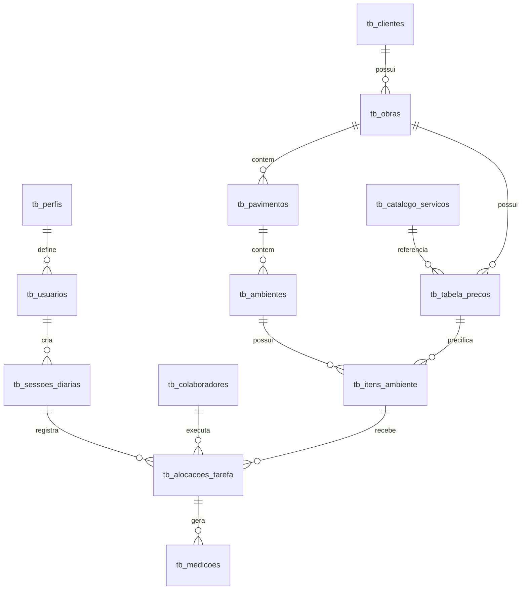

# ESPECIFICAÇÃO DE REQUISITOS DE SOFTWARE (ERS)

**Projeto:** ERP de Gestão de Obras - JB Pinturas  
**Versão:** 4.0 (Versão Definitiva)  
**Status:** Aprovado para Desenvolvimento  
**Data:** Fevereiro 2026

---

## 1. Introdução

### 1.1 Contexto e Problema

Atualmente, a gestão de obras na **JB Pinturas** enfrenta desafios operacionais devido ao uso descentralizado de planilhas e apontamentos manuais em papel (RDOs físicos). Isso resulta em:

* Dificuldade de rastreabilidade (quem fez o quê e quando).
* Lentidão no fechamento de medições quinzenais.
* Falta de visão em tempo real sobre a lucratividade (Custo vs. Receita).
* Erros de comunicação entre o canteiro de obras e o escritório.

### 1.2 Objetivo da Solução (ERP)

O novo sistema ERP visa centralizar e digitalizar todo o fluxo de trabalho. A solução proporcionará:

* **Auditabilidade:** Histórico imutável de ações.
* **Mobilidade:** App para encarregados operarem 100% offline.
* **Inteligência Financeira:** Cálculo automático de margem de lucro por serviço e por obra.
* **Padronização:** Catálogo único de serviços e preços.

---

## 2. Matriz de Perfis e Atribuições (RBAC)

| Perfil | Descrição e Nível de Acesso |
| --- | --- |
| **Administrador** | **Sistema.** Gestão de usuários, auditoria e configurações. Acesso a logs de erro. |
| **Gestor** | **Decisão.** Aprova preços de venda (receita), valida medições técnicas, vê margem de lucro e dados bancários sem máscara. |
| **Financeiro** | **Caixa.** Cadastra Clientes e Preços de Venda (requer aprovação). Realiza pagamentos. Acesso a dados sensíveis. |
| **Encarregado** | **Operação.** Cadastra obras, aloca tarefas, lança produção. **Perfil cego financeiramente** (não vê preços de venda). |
| **Colaborador** | **Recurso.** Sem login. Entidade passiva para alocação e pagamento. |

---

## 3. Requisitos Funcionais (RF)

### Módulo 1: Cadastros e Engenharia

*Descrição: Responsável pela estruturação dos dados base do sistema, permitindo a criação de obras, ambientes e a gestão do catálogo de serviços.*

* **RF01 - Cadastro de Obras Descentralizado:** Encarregado cria obras (Nome, Endereço, Prazos).
* **RF02 - Hierarquia de Ativos:** Estrutura *Obra > Pavimento > Ambiente*.
* **RF03 - Catálogo de Serviços:** Base global (`m²`, `ml`, `un`, `vb`).

### Módulo 2: Gestão Financeira

*Descrição: Foca na precificação dual (Custo/Venda), aprovações de margem e controle de fluxo de caixa.*

* **RF04 - Fluxo de Preço de Venda (Com Validação):**
  * Financeiro insere valor de venda.
  * **Regra de Aprovação:** O sistema exibe ao Gestor a margem calculada (`Preço Venda - Preço Custo`). O Gestor deve validar se a margem atende à política mínima da empresa antes de aprovar.

* **RF05 - Preço de Custo:** Editável por Encarregado/Financeiro.

### Módulo 3: Operação Mobile (Offline-First)

*Descrição: Interface de campo para o Encarregado, focada em agilidade, funcionamento sem internet e coleta de evidências.*

* **RF06 - RDO Digital:** Sessão com geolocalização e assinatura do cliente.
* **RF07 - Alocação 1:1 com Bloqueio UI:**
  * Se o Encarregado tentar arrastar um colaborador para um ambiente ocupado, a interface deve exibir um **feedback visual (Toast/Shake)** e desabilitar a ação. Mensagem: *"Ambiente em uso por [Nome do Atual]. Encerre a tarefa anterior primeiro."*

* **RF08 - Excedentes:** Medição > Área cadastrada exige Justificativa e Foto.

### Módulo 4: Notificações e Alertas

*Descrição: Central de comunicação proativa para evitar atrasos e esquecimentos.*

* **RF09 - Alertas Operacionais:** Push para Encarregado sobre medições pendentes.
* **RF10 - Alertas Financeiros:** Aviso de ciclo de faturamento próximo.

---

## 4. Regras de Negócio (RN)

* **RN01 - Cegueira Financeira:** Encarregado nunca vê Preços de Venda.
* **RN02 - Travamento de Faturamento:**
  * Regra: Não gera medição se preço estiver "Em Análise".
  * *Exceção:* O perfil **Administrador** pode forçar a geração do faturamento mediante inserção de uma "Justificativa de Exceção" no log de auditoria.

* **RN03 - Unicidade:** Um ambiente = Um colaborador ativo.
* **RN04 - Segurança de Dados Estendida:**
  * Dados bancários mascarados na interface (`***`).
  * Criptografia **AES-256** para dados sensíveis no banco (em repouso).
  * Protocolo **TLS 1.2+** obrigatório para dados em trânsito (API).

---

## 5. Diretrizes de Interface e UX

### 5.1. Acessibilidade e Usabilidade

* **Contraste (WCAG 2.1 AA):** Garantir contraste suficiente entre texto e fundo, especialmente para uso sob sol forte na obra (Modo Alto Contraste opcional).
* **Navegação por Teclado:** O painel Web deve ser totalmente operável via `Tab`, `Enter` e `Esc` para agilidade do Financeiro.
* **Feedback de Sincronização:**
  * Status claro: "Sincronizado há 2 min" vs "Offline - 5 pendências".
  * Indicador visual de "Salvando..." não intrusivo.

### 5.2. Design System

* **Web:** Split View para comparação financeira. Tabelas com *Zebra Striping*.
* **Mobile:** Botões grandes (Thumb Zone). Steppers para contagem.

---

## 6. Arquitetura de Banco de Dados (Schema Detalhado)

O Sistema de Gestão de Base de Dados (SGBD) recomendado é o **PostgreSQL 15+**.
A modelagem segue a estratégia *Distributed ID* (UUID v4) para suportar a geração de registos offline no telemóvel sem colisão com o servidor.

### 6.1. Convenções Globais

* **Chaves Primárias (PK):** `UUID` (Gerado no cliente ou servidor).
* **Timestamps:** Todas as tabelas possuem `created_at` e `updated_at` (UTC) para controlo de sincronização (Delta Sync).
* **Soft Delete:** Todas as tabelas possuem `deleted_at` (Indexado). Registos nunca são apagados fisicamente para manter integridade histórica.

---

### 6.2. Domínio: Identidade e Segurança (IAM)

*Responsável por autenticação e gestão de acessos.*

#### `tb_perfis` (Domínio Estático)

| Coluna | Tipo | Detalhe |
| --- | --- | --- |
| `id` | INT | PK (1=Admin, 2=Gestor, 3=Financeiro, 4=Encarregado) |
| `nome` | VARCHAR(50) | Unique. |
| `permissoes_json` | JSONB | Matriz de capacidades (Ex: `{"can_approve_price": true}`). |

#### `tb_usuarios`

| Coluna | Tipo | Detalhe |
| --- | --- | --- |
| `id` | UUID | PK. |
| `nome_completo` | VARCHAR(150) |  |
| `email` | VARCHAR(100) | Unique Index. Login. |
| `senha_hash` | VARCHAR(255) | Bcrypt ou Argon2. |
| `id_perfil` | INT | FK -> `tb_perfis`. |
| `fcm_token` | VARCHAR(255) | Token para Push Notifications (Mobile). |
| `status` | ENUM | 'ATIVO', 'INATIVO'. |

---

### 6.3. Domínio: Estrutura de Obra (Engenharia)

*Estrutura hierárquica dos ativos.*

#### `tb_obras`

| Coluna | Tipo | Detalhe |
| --- | --- | --- |
| `id` | UUID | PK. |
| `nome` | VARCHAR(100) | Indexado para busca. |
| `endereco_completo` | TEXT |  |
| `data_inicio` | DATE |  |
| `data_previsao_fim` | DATE |  |
| `id_cliente` | UUID | FK -> `tb_clientes`. |
| `id_usuario_criador` | UUID | FK -> `tb_usuarios` (Encarregado que abriu). |
| `status` | ENUM | 'PLANEJAMENTO', 'ATIVA', 'SUSPENSA', 'CONCLUIDA'. |

#### `tb_pavimentos` (Setorização)

| Coluna | Tipo | Detalhe |
| --- | --- | --- |
| `id` | UUID | PK. |
| `id_obra` | UUID | FK -> `tb_obras` (Delete Cascade). |
| `nome` | VARCHAR(50) | Ex: "5º Pavimento", "Térreo". |
| `ordem` | INT | Para ordenação visual na lista. |

#### `tb_ambientes` (Unidades de Trabalho)

| Coluna | Tipo | Detalhe |
| --- | --- | --- |
| `id` | UUID | PK. |
| `id_pavimento` | UUID | FK -> `tb_pavimentos`. |
| `nome` | VARCHAR(50) | Ex: "Apto 3401", "Escadaria Norte". |
| `status_bloqueio` | BOOLEAN | Default `false`. Usado para bloquear trabalho no local. |

---

### 6.4. Domínio: Financeiro e Precificação (Core)

*Onde reside a lógica de Custo vs. Venda.*

#### `tb_clientes`

| Coluna | Tipo | Detalhe |
| --- | --- | --- |
| `id` | UUID | PK. |
| `razao_social` | VARCHAR(150) |  |
| `cnpj_nif` | VARCHAR(20) | Unique. |
| `dia_corte` | INT | Dia do mês para fechar faturação (1-31). |

#### `tb_catalogo_servicos` (Global)

| Coluna | Tipo | Detalhe |
| --- | --- | --- |
| `id` | INT | PK Serial. |
| `nome` | VARCHAR(100) | Ex: "Pintura Látex 2 Demãos". |
| `unidade_medida` | ENUM | 'M2', 'ML', 'UN', 'VB'. |
| `permite_decimal` | BOOLEAN | Regra de interface (Bloqueia vírgula se false). |

#### `tb_tabela_precos` (Tabela de Conversão)

*Tabela crítica que liga o Serviço Genérico à Obra Específica com preços.*

| Coluna | Tipo | Detalhe |
| --- | --- | --- |
| `id` | UUID | PK. |
| `id_obra` | UUID | FK -> `tb_obras`. |
| `id_servico_catalogo` | INT | FK -> `tb_catalogo_servicos`. |
| `preco_custo` | DECIMAL(10,2) | **Visível ao Encarregado**. (Valor a pagar). |
| `preco_venda` | DECIMAL(10,2) | **Oculto ao Encarregado**. (Valor a receber). |
| `status_aprovacao` | ENUM | 'PENDENTE', 'APROVADO', 'REJEITADO'. |

#### `tb_itens_ambiente` (Escopo Planeado)

| Coluna | Tipo | Detalhe |
| --- | --- | --- |
| `id` | UUID | PK. |
| `id_ambiente` | UUID | FK -> `tb_ambientes`. |
| `id_tabela_preco` | UUID | FK -> `tb_tabela_precos`. |
| `area_planejada` | DECIMAL(10,2) | Meta física (m² ou qtd). |

---

### 6.5. Domínio: Operação de Campo (Offline Sync)

#### `tb_colaboradores` (Recursos)

| Coluna | Tipo | Detalhe |
| --- | --- | --- |
| `id` | UUID | PK. |
| `nome` | VARCHAR(100) |  |
| `cpf` | VARCHAR(11) | Indexado. |
| `dados_bancarios_enc` | TEXT | **Criptografado (AES-256)** no nível da aplicação. |
| `url_termo_aceite` | TEXT | Link para PDF no S3/Blob Storage. |
| `ativo` | BOOLEAN | Default `true`. |

#### `tb_sessoes_diarias` (RDO)

| Coluna | Tipo | Detalhe |
| --- | --- | --- |
| `id` | UUID | PK. |
| `id_encarregado` | UUID | FK -> `tb_usuarios`. |
| `data_sessao` | DATE |  |
| `hora_inicio` | TIMESTAMPTZ | UTC. |
| `hora_fim` | TIMESTAMPTZ | UTC (Nullable). |
| `geo_lat` | FLOAT | GPS Latitude. |
| `geo_long` | FLOAT | GPS Longitude. |
| `assinatura_url` | TEXT | Imagem da rubrica do responsável. |

#### `tb_alocacoes_tarefa` (Quem faz o quê agora)

| Coluna | Tipo | Detalhe |
| --- | --- | --- |
| `id` | UUID | PK. |
| `id_sessao` | UUID | FK -> `tb_sessoes_diarias`. |
| `id_item_ambiente` | UUID | FK -> `tb_itens_ambiente`. |
| `id_colaborador` | UUID | FK -> `tb_colaboradores`. |
| `status` | ENUM | 'EM_ANDAMENTO', 'CONCLUIDO', 'PAUSADO'. |
| `constraint_unicidade` | UNIQUE | (`id_item_ambiente`) WHERE `status` = 'EM_ANDAMENTO'. **(Garante Regra 1:1)** |

#### `tb_medicoes` (O Resultado)

| Coluna | Tipo | Detalhe |
| --- | --- | --- |
| `id` | UUID | PK. |
| `id_alocacao` | UUID | FK -> `tb_alocacoes_tarefa`. |
| `qtd_executada` | DECIMAL(10,2) | Valor final apontado. |
| `flag_excedente` | BOOLEAN | True se `qtd` > `area_planejada`. |
| `justificativa` | TEXT | Obrigatório se flag=true. |
| `foto_evidencia_url` | TEXT |  |
| `status_pagamento` | ENUM | 'ABERTO', 'LOTE_CRIADO', 'PAGO'. |
| `id_lote_pagamento` | UUID | FK (Nullable) -> Tabela de Lotes Financeiros. |

---

### 6.6. Domínio: Auditoria e Logs

#### `tb_audit_logs` (Imutável)

| Coluna | Tipo | Detalhe |
| --- | --- | --- |
| `id` | BIGINT | PK Auto-increment (Sequencial). |
| `momento` | TIMESTAMPTZ | Default NOW(). |
| `id_usuario` | UUID | Quem fez. |
| `tabela_afetada` | VARCHAR | Ex: 'tb_tabela_precos'. |
| `id_registo` | UUID | ID da linha afetada. |
| `acao` | ENUM | 'INSERT', 'UPDATE', 'DELETE', 'APPROVE'. |
| `payload_antes` | JSONB | Snapshot dos dados antes. |
| `payload_depois` | JSONB | Snapshot dos dados novos. |

---

### 6.7. Diagrama de Relacionamento (Conceitual)

---

## 7. Stack Tecnológico e Justificativas

### 7.1. Backend

* **Framework:** NestJS (Node.js/TypeScript).
  * *Porquê:* Arquitetura modular, fácil manutenção e tipagem forte que reduz bugs.

* **Segurança:** Autenticação JWT + **MFA (Multi-Factor Authentication)** obrigatório para perfis Financeiro e Gestor (via App Authy ou Google Auth).

### 7.2. Frontend & Mobile

* **Web:** React.js + Material UI.
  * *Porquê:* Componentes de "Data Grid" nativos excelentes para o financeiro.

* **Mobile:** React Native + **WatermelonDB**.
  * *Porquê:* WatermelonDB é otimizado para *Lazy Loading* em bancos locais grandes, essencial para obras com milhares de registros offline.

### 7.3. Infraestrutura

* **Banco de Dados:** PostgreSQL.
  * *Porquê:* Robustez em transações financeiras (ACID compliance).

* **Files:** AWS S3 (Armazenamento de fotos e assinaturas).

---

## 8. Requisitos Não-Funcionais (RNF)

### RNF01 - Disponibilidade

* **Uptime:** 99.5% mensal.
* **Backup:** Diário incremental + Semanal completo (Retenção: 30 dias).

### RNF02 - Segurança

* Criptografia AES-256 para dados sensíveis em repouso.
* TLS 1.2+ obrigatório para transmissão.
* MFA obrigatório para Financeiro e Gestor.
* Auditoria completa (logs imutáveis).

### RNF03 - Performance e Otimização

* **Lazy Loading:** O App Mobile deve carregar a lista de ambientes sob demanda (paginação infinita) para não travar a memória do dispositivo.
* **Compressão de Imagem:** Fotos de evidência devem ser comprimidas no cliente (Mobile) para máx. 1024px e 80% qualidade antes do upload, economizando dados móveis.
* **Cache:** Utilizar Redis para cachear o "Dashboard Financeiro" (TTL 5 min), evitando queries pesadas repetitivas.

### RNF04 - Jobs e Rotinas (Background Tasks)

* **Tecnologia:** BullMQ (Redis).
* **Periodicidade:**
  * *Verificação de Prazos:* Diariamente às 06:00 AM.
  * *Consolidação de Dashboard:* A cada 1 hora.

* **Tratamento de Erros:** Implementar **Dead Letter Queue (DLQ)**. Se um job de notificação falhar 3 vezes, ele vai para uma fila de erro para análise do desenvolvedor, não travando o sistema.

---

## 9. Roadmap de Implementação

### Fase 1 (MVP - 3 meses)
- [ ] Backend: Módulos de autenticação e cadastros base
- [ ] Backend: API de obras e ambientes
- [ ] Frontend: Telas de login e cadastro de obras
- [ ] Database: Migration inicial com tabelas core

### Fase 2 (4 meses)
- [ ] Backend: Módulo financeiro completo
- [ ] Backend: Sistema de aprovação de preços
- [ ] Frontend: Dashboard financeiro
- [ ] Mobile: App básico com funcionalidade offline

### Fase 3 (3 meses)
- [ ] Mobile: RDO digital completo
- [ ] Backend: Sistema de notificações (Push)
- [ ] Backend: Jobs e rotinas automatizadas
- [ ] Frontend: Relatórios e dashboards avançados

### Fase 4 (2 meses)
- [ ] Testes de integração completos
- [ ] Auditoria de segurança
- [ ] Deploy em produção
- [ ] Treinamento de usuários

---

## 10. Critérios de Aceitação

### CA01 - Funcional
- [ ] Todas as RFs implementadas e testadas
- [ ] Validações de RNs funcionando corretamente
- [ ] Sistema offline-first operacional no mobile

### CA02 - Performance
- [ ] Tempo de resposta da API < 200ms (P95)
- [ ] App mobile funciona 100% offline
- [ ] Sincronização completa em < 30 segundos

### CA03 - Segurança
- [ ] Criptografia AES-256 implementada
- [ ] MFA funcionando para perfis críticos
- [ ] Auditoria completa de ações

### CA04 - UX
- [ ] Interface responsiva em todos os dispositivos
- [ ] Conformidade WCAG 2.1 AA
- [ ] Feedback visual em todas as ações

---

## 11. Glossário

| Termo | Definição |
|-------|-----------|
| **RDO** | Relatório Diário de Obras - Documento de apontamento de produção |
| **Medição** | Quantificação física do trabalho executado (m², ml, un) |
| **Alocação 1:1** | Regra que impede dois colaboradores no mesmo ambiente simultaneamente |
| **Cegueira Financeira** | Perfil Encarregado não visualiza preços de venda |
| **Delta Sync** | Sincronização incremental (apenas diferenças) |
| **Soft Delete** | Exclusão lógica (flag deleted_at) sem remoção física |

---

**Aprovações:**

| Papel | Nome | Assinatura | Data |
|-------|------|------------|------|
| Product Owner | | | |
| Tech Lead | | | |
| Arquiteto de Software | | | |

---

*Documento controlado - Versão 4.0*
